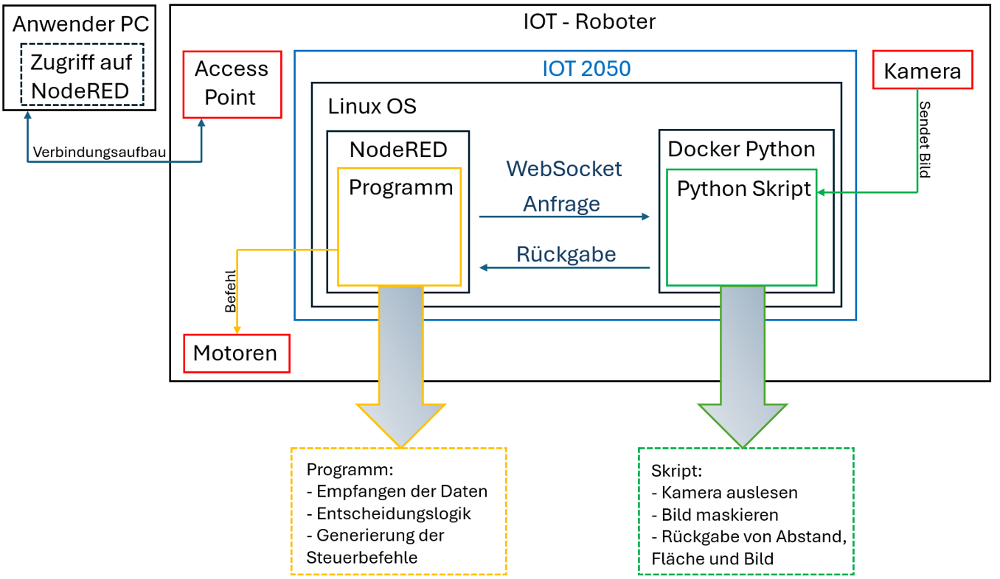

# EduArt-Robotik-Webcam-Pythonskript

Dieses Projekt ermöglicht die Steuerung eines Roboters über Node-RED mithilfe von Webcam-Daten, die über ein Python-Skript verarbeitet und per WebSocket übertragen werden.

---

## 📚 Dokumentation

🔗 [PDF-Dokumentation]()

---

## 💡 Tipps

Hier sind ein paar hilfreiche Zusatzinformationen zusammengetragen:

🔗 [Linux-Spickzettel](https://github.com/tisch017/EduArt-Robotik-Webcam-Pythonskript/tree/main/Tipps)

---

## 🔧 Komponenten

### 1. Python-Skript für die IOT2050

Das Python-Skript nimmt die Daten einer Webcam auf und sendet sie über WebSocket an Node-RED zur Robotersteuerung. Es läuft direkt auf der IOT2050.

🔗 [IOT-Python-Skript](https://github.com/tisch017/EduArt-Robotik-Webcam-Pythonskript/tree/main/IOT-Bot-Linux)

---

### 2. Node-RED Flow

Der Flow zur Verarbeitung der Webcam-Daten und zur Steuerung des Roboters.

🔗 [Zum GitHub-Ordner mit dem Node-RED Flow]()

---

### 3. Python-Skript mit GUI

Ein angepasstes Python-Skript mit grafischer Oberfläche zur Anzeige verschiedener Fenster, z. B. zur Kamerasteuerung oder Farbauswahl.

🔗 [Python Sküirt mit GUI](https://github.com/tisch017/EduArt-Robotik-Webcam-Pythonskript/tree/main/GUI%20Skript)

Ein Docker-Container zur Ausführung des Python-Skripts auf der IOT2050 (eingeschränkte Funktionalität).

### 4. Docker Container für die IOT2050

Ein Docker Container zur Ausführung des Python-Skripts auf der IOT2050 (keien Funktionalität erreichen).

🔗 [Docker Container](https://github.com/tisch017/EduArt-Robotik-Webcam-Pythonskript/tree/main/Docker-Image)

## 🖼️ Übersicht

---

## 📌 Hinweise

- Die Kommunikation zwischen Python-Skript und Node-RED erfolgt über WebSocket.
- Das Projekt ist für den Einsatz auf der Siemens IOT2050 optimiert.
- Das Projekt ist im Rahmen der SPE Hannover entstanden.
